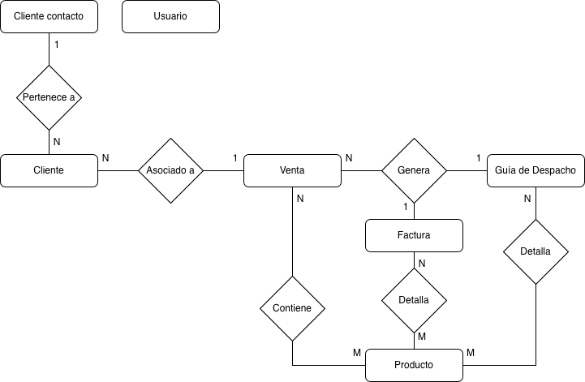
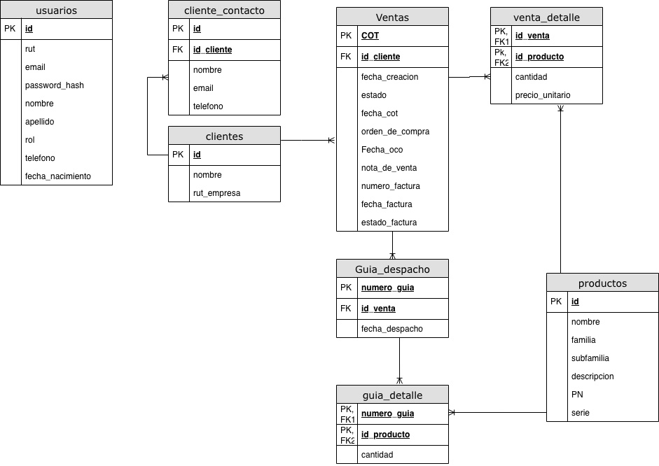

# Proyecto Arquitectura de Software: 
Repositorio para nuestro proyecto de Arquitectura de Software.

### Integrantes
- Diego Banda ([DiegoBan](https://github.com/DiegoBan))
- Branco Burotto ([branxeto](https://github.com/branxeto))
- Valentína Garcia ([balentula](https://github.com/balentula))
- Diego Salazar ([HoHenHeimpepsi](https://github.com/HoHenHeimpepsi))

## Sobre el proyecto
Software creado con el objetivo de eficientizar, y coordinar registro de ventas, facturación, clientes, etc. Se utiliza la arquitectura SOA, con un bus central que gestiona la comunicación entre el cliente de la aplicación y los distintos servicios encargados de la lógica, cálculos, guardado de registros en base de datos, etc.

### Cómo levantar proyecto
Los distintos servicios están creados para ser contenidos en Docker, cada uno con su propio contenedor, de esta manera se mantiene el ambiente correctamente separado para cada uno.

Para levantar el proyecto se utiliza el siguiente comando en la carpeta principal del proyecto:
```
docker compose up --build -d
```

## Cliente

### Librerias FrontEnd
usar el comando 
```
pip install -r requirements.txt
```
Luego para iniciar el front se debe ejecutar primero el dockerfile del backend, el cual se encuentra en la carpeta raiz del proyecto. Luego ir a la carpeta "FrontEnd" y copiar el siguiente comando.
```
python main.py
```
De esa forma se usa ejecutaran las vistas de la aplicación 

## Servicios

### Base de Datos
Como base de datos utilizamos postgreSQL, ya que gracias a su modelo relacional y estructura permite crear las relaciones necesarias sin problemas a la vez que se mantienen los datos consistentemente, cumpliendo con las propiedades ACID (Atomicidad, Consistencia, Aislamiento y Durabilidad), algo de suma importancia para un software al que no se le puede pasar por alto nada.

<p align="center">
    
</p>
<p align="center">
    
</p>

En caso de querer acceder a la consola del contenedor con postgreSQL, ejecuta:
```
docker exec -it postgres_db psql -U admin -d db
```

La librería utilizada para conectar PostgresSQL con Python será 'psycopg2'.

---
### Servicio Usuario
El servicio **Usuario** tiene la responsabilidad de gestionar las operaciones lógicas sobre la tabla `Usuarios` en la base de datos. Actúa como intermediario: recibe la petición del servicio *Cliente*, valida la información de negocio y construye la consulta SQL para enviarla al servicio *Base de Datos* a través del bus.

**Librerías utilizadas:**
* `time`: Para manejo de pausas o marcas de tiempo.
* `json`: Para la serialización y deserialización de mensajes.
* `soa_lib`: Para la comunicación por sockets con el Bus SOA.

### Tareas del Servicio

#### 1. Crear usuario (`crear_usuario`)
Cuando un cliente solicita registrar un nuevo usuario, el servicio espera recibir un JSON con la acción y los datos correspondientes.

**JSON recibido desde el Cliente:**
```json
{
  "accion": "crear_usuario",
  "rut": "12.345.678-9",
  "email": "el7@colocolo.cl",
  "password_hash": "$2b$12$K3B...hash_de_la_contraseña...",
  "nombre": "Esteban",
  "apellido": "Paredes",
  "rol": "usuario",
  "telefono": "+56961486932",
  "Fecha_nacimiento": "1980-08-01"
}
```

#### 2. Iniciar sesión (`iniciar_sesion`)
Cuando un cliente solicita iniciar sesión en su cuenta previamente registrada, el servicio espera recibir un JSON con la acción y los datos correspondientes.

**JSON recibido desde el Cliente**
```json
{
  "accion": "iniciar_sesion",
  "email": "el7@colocolo.cl",
  "password_hash": "$2b$12$K3B...hash_de_la_contraseña..."
}
```

#### 3. Modificar rol (`modificar_rol`)
Cuando un administrador desea cambiar el rol de un usuario del sistema, primero debe encontrarse debidamente logeado con anterioridad y tener un rol apto para realizar tal cambio. La función espera recibir un JSON de la siguiente manera.

**JSON recibido desde el Cliente**
```json
{
  "accion": "modificar_rol",
  "modificador_id": "3",
  "modificar_id": "7",
  "nuevo_rol": "vendedor"
}
```

El cliente recibirá un json según el resultado de la operación:

- Usuario de modificador no encontrado:
```json
{
  "estado": "error",
  "mensaje": "Usuario modificador no encontrado"
}
```
- Modificador no es admin:
```json
{
  "estado": "error",
  "mensaje": "Usuario no es admin"
}
```
- Error interno:
```json
{
  "estado": "error",
  "mensaje": "error interno del servidor"
}
```
- Usuario a modificar no existe
```json
{
  "estado": "error",
  "mensaje": "Usuario a modificar no existe"
}
```
- Modificación con éxito
```json
{
  "estado": "ok",
  "mensaje": "rol modificado"
}
```
---
### Servicio Cliente

El servicio Cliente es el encargado de gestionar la información de las entidades a las que se les factura o se les registra una venta. Al igual que los demás servicios, recibe peticiones desde el bus SOA, valida permisos críticos (como verificar si el usuario es administrador) y formatea los registros de la base de datos para entregarlos limpios al FrontEnd.

### Tareas del Servicio
#### 1. Obtener clientes (`obtener_clientes`)

Cuando una vista del FrontEnd requiere listar el directorio de clientes, el servicio realiza una consulta a la base de datos y transforma los registros crudos en una lista de diccionarios, facilitando su consumo y renderizado.

Respuesta JSON enviada hacia el Cliente (Ejemplo exitoso):
JSON
```json
{
  "estado": "ok",
  "mensaje": "Clientes obtenidos",
  "clientes": [
    {
      "id": 1,
      "nombre": "Blanco y Negro S.A.",
      "rut_empresa": "99.999.999-9"
    },
    {
      "id": 2,
      "nombre": "Inmobiliaria Monumental",
      "rut_empresa": "88.888.888-8"
    }
  ]
}
```
#### 2. Actualizar cliente (`actualizar_cliente`)

Este método se encarga de modificar los datos de un cliente existente. Cuenta con una validación de seguridad estricta: antes de ejecutar el UPDATE, verifica en la tabla de usuarios que quien solicita la acción posea el rol de admin.

JSON esperado desde el Cliente:
JSON
```json
{
  "accion": "actualizar_cliente",
  "user": "12.345.678-9",
  "id": 1,
  "nombre": "Nuevo Nombre Cliente",
  "rut_empresa": "77.777.777-7"
}
```
Respuesta JSON enviada hacia el Cliente (Ejemplo exitoso):
JSON
``` json
{
  "estado": "ok",
  "mensaje": "Actualización exitosa",
  "detalles": {
    "nombre": "Nuevo Nombre Cliente",
    "rut_empresa": "77.777.777-7"
  }
}
```
#### 3. Registrar cliente (`registrar_cliente`)

Esta función permite agregar un nuevo cliente a la base de datos del sistema. Al igual que en la actualización, cuenta con una barrera de seguridad que valida que el usuario (`user`) que solicita realizar la inserción posea privilegios de administrador.

**JSON esperado desde el Cliente:**
```json
{
  "accion": "registrar_cliente",
  "user": "12.345.678-9",
  "nombre": "Nuevo Cliente S.P.A",
  "rut_empresa": "66.666.666-6"
}
```
---
### Servicio Productos

El servicio **Productos** es el encargado de gestionar el catálogo o inventario de la empresa. Permite la consulta y el registro de nuevos artículos que posteriormente serán utilizados en ventas o facturaciones. Al igual que los demás servicios transaccionales, cuenta con validación de roles para proteger la creación de registros.

### Tareas del Servicio

#### 1. Obtener productos (`obtener_productos`)

Este método se encarga de consultar la base de datos para extraer todo el catálogo de productos disponibles. Transforma los datos recibidos en una lista de diccionarios con el nombre de cada columna, facilitando su lectura para el FrontEnd.

**Respuesta JSON enviada hacia el Cliente (Ejemplo exitoso):**
```json
{
  "estado": "ok",
  "mensaje": "Productos obtenidos",
  "productos": [
    {
      "id": 1,
      "nombre": "Tubo de Cobre 1/2",
      "familia": "Gasfitería",
      "subfamilia": "Cañerías",
      "descripcion": "Tubo de cobre tipo L para instalación de agua",
      "PN": "TC-001-L",
      "serie": "N/A"
    },
    {
      "id": 2,
      "nombre": "Notebook ThinkPad",
      "familia": "Electrónica",
      "subfamilia": "Computación",
      "descripcion": "Notebook para uso de oficina",
      "PN": "TP-T14-Gen3",
      "serie": "PF12345X"
    }
  ]
}
```
#### 2. Crear producto (`crear_producto`)

Esta función permite registrar un nuevo producto en el inventario. Implementa una validación de seguridad estricta para asegurar que únicamente los usuarios administradores (verificados mediante su RUT en el campo `user`) puedan añadir artículos nuevos al catálogo.

**JSON esperado desde el Cliente:**
```json
{
  "accion": "crear_producto",
  "user": "12.345.678-9",
  "nombre": "Tubo de PVC 110mm",
  "familia": "Construcción",
  "subfamilia": "Desagüe",
  "descripcion": "Tubo de PVC sanitario de 6 metros",
  "PN": "PVC-110-S",
  "serie": "Lote-2023X"
}
```

---
### Servicio Manejo de Datos

Sevicio crítico que administra todo el funcionamiento del negocio y resuelve el problema inicial y objetivo del proyecto. Gestiona inventario y ciclo de vida comercial de una venta.

### Tareas del Servicio

#### 1. Crear cotización (`crear_cot`)

Esta función permite registrar una nueva venta/cotización al sistema junto a todos sus datos relacionados.

**JSON esperado desde el CLiente:**
```json
{
"accion": "crear_cot",
"COT": 12345,
"id_cliente": 3,
"fecha_cot": "2026-06-13",
"productos": [
  {
    "id_producto": 4,
    "cantidad": 5,
    "precio_unitario": 1000
  },
  {
    "id_producto": 10,
    "cantidad": 2,
    "precio_unitario": 25000
  }
]
}
```
Dependiendo de la respuesta, se retornará un JSON distinto:
- Operación ejecutada con éxtio:
```json
{
"estado": "ok",
"mensaje": "Cotización creada correctamente"
}
```
- Algún error evitó la creación:
```json
{
"estado": "error",
"mensaje": "error interno del servidor"
}
```
- Cotización creada con éxito:
```json
{
"estado": "ok",
"mensaje": "Cotización creada correctamente"
}
```

#### 2. Actualización (`act_cot`)

Actualiza el estado y datos faltantes de una venta o cotización según los datos entregados enviados desde el frontend. 
- En caso de actualizar desde 'COTIZADO' a 'OCO' se debe recibir un JSON como el siguiente:
```json
{
"accion": "act_cot",
"COT": 12345,
"orden_de_compra": "4300027762",
"fecha_oco": "2026-06-14",
"nota_de_venta": 12233
}
```
- En caso de actualizar desde 'OCO' a 'FACTURADO' se debe recibir un JSON como el siguiente:
```json
{
"accion": "act_cot",
"COT": 12345,
"facturas": [
  {
    "numero_factura": 11223,
    "fecha": "2026-06-15",
    "productos": [
      {
        "id_producto": 4,
        "cantidad": 5
      },
      {
        "id_producto": 10,
        "cantidad": 1
      }
    ]
  },
  {
    "numero_factura": 11224,
    "fecha": "2026-06-15",
    "productos" [
      {
        "id_producto": 10,
        "cantidad": 1
      }
    ]
  }
]
}
```

#### 3. Actualización excepcional (`act_excep`)

En cuanto a la actualización excepcional se realiza para pasar de COTIZACION a OCO sin una orden de compra, esta acción solo se puede realizar por alguien con el rol de dueño.

**JSON esperado desde el Cliente:**
```json
{
"accion": "act_excep",
"COT": 12345,
"user": "12.345.678-9"
}
```

#### 4. Entrega parcial (`entrega_par`)


---
### Servicio Análisis de Datos

Servicio que recopila los datos necesarios para crear los distintos gráficos. Gráficos que se utilizan para realizar correctos análisis sobre el estado actual del negocio.

### Tareas del Servicio

#### 1. Gráfico de clientes (`grafico_clientes`)

Provee de los datos necesarios para generar un gráfico histórico que muestre el volumen de ventas, segmentado por cada cliente, así como el detalle de su deuda activa, con la capacidad de agrupar y filtrar la información por mes y por año.

**JSON esperado desde el cliente**
```json
{
"accion": "grafico_clientes",
"fecha_inicio": "2025-06",
"fecha_fin": "2026-06",
"agrupar": "mes"
}
```
**JSON que retorna función**
```json
{
"estado": "ok",
"mensaje": "Datos obtenidos correctamente",
"clientes": [
  {
    "id_cliente": 1,
    "nombre_cliente": "colo-colo",
    "periodos": [
      {
        "per": "2026-01", //  año, mes
        "ventas": 5500000,  //  ventas totales
        "deuda": 1200000  //  deuda activa del mes
      },
      {
        "per": "2026-02",
        "ventas": 1500000,
        "deuda": 1500000
      }
    ]
  },
  {
    "id_cliente": 2,
    "nombre_cliente": "udechile",
    "periodos": [
      {
        "per": "2026-01",
        "ventas": 1500000,
        "deuda": 1100000,
      },
      {
        "per": "2026-02",
        "ventas": 100,
        "deuda": 0
      }
    ]
  }
]
}
```

#### 2. Gráfico productos (`grafico_productos`)

Provee de los datos necesarios para crear un gráfico de ventas de los productos.

**JSON esperado desde el cliente**
```json
{
"accion": "grafico_productos",
"fecha_inicio": "2025-06-10",
"fecha_fin": "2026-06-10"
}
```
- Si todo sale bien, retorna JSON con los productos y la cantidad vendida en orden descendiente:
**JSON retornado de ejemplo**
```json
{
"estado": "ok",
"mensaje": "Datos obtenidos correctamente",
"datos": [
  {
    "id_producto": 2,
    "nombre": "Notebook ThinkPad",
    "cantidad": 10
  },
  {
    "id_producto": 1,
    "nombre": "Tubo de Cobre 1/2",
    "cantidad": 2
  }
]
}
```